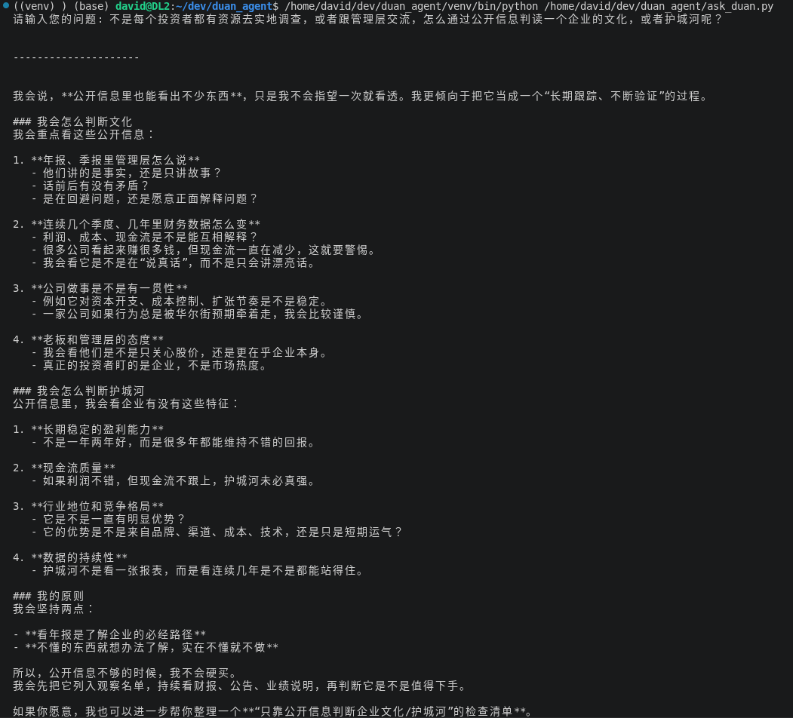

## Value Investing Duan Yongping style
Duan Yongping (段永平) is a lengadery enterpreurer and investor who is rumored to be the richest Chinese alive. In his earlier career he started companies such as BBK, Oppo, and vivo and grew them to billion dollars each. He retired in his 40s, and spent his time mostly on golfing and parenting his children. 

In his leisure time he discovered the hobby of investing. Through a series of successful investment such as in NetEase, Apple, Maotai and etc, he grew his wealth to an eastimated 15B dollars. 

### Methodology
Thanks to Duan's interaction with the generic public, we have a rich collection of his comments and remarks on Value Investing and his own investing philosophy. These public Q&A can be found [here.](https://baike.baidu.com/item/%E6%AE%B5%E6%B0%B8%E5%B9%B3%E6%8A%95%E8%B5%84%E9%97%AE%E7%AD%94%E5%BD%95%EF%BC%88%E6%8A%95%E8%B5%84%E9%80%BB%E8%BE%91%E7%AF%87%EF%BC%89/57572157) 

We index his public comments in a vector DB and use it for RAG so we have an Agent that teaches us about value investing in Duan style. 

## Installation Prerequisites
<ul>
  <li>Python 3.12+</li>
</ul>

## Installation
<h3>1. Clone the repository:</h3>

```
git clone https://github.com/davyuan/duan_yongping.git
cd duan_yongping
```

<h3>2. Create a virtual environment</h3>

```
python -m venv venv
```

<h3>3. Activate the virtual environment</h3>

```
venv\Scripts\Activate
(or on Mac/Linux): source venv/bin/activate
```

<h3>4. Install libraries</h3>

```
pip install -r requirements.txt
```

<h3>5. Add OpenAI API Key</h3>
Get an OpenAI API Key from here: https://platform.openai.com/settings/organization/admin-keys<BR>
Add it to .env.example<BR>
Rename to .env<BR>

## Executing the scripts

- Open a terminal in VS Code

- Execute the following command:

```
python fill_vector_db.py 'data/段永平投资问答录(投资逻辑篇).json'
python ask_duan.py
```
## Result

